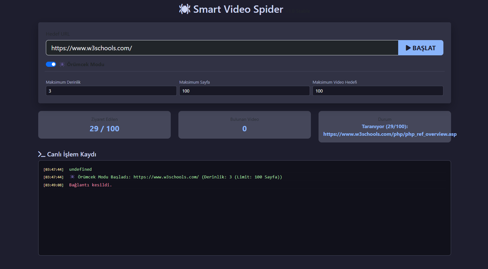

# 🕷️ Smart Video Spider


**Smart Video Spider**, web sitelerini örümcek ağı mantığıyla (Crawling) tarayan, sayfalar arasındaki bağlantıları takip eden ve bulduğu videoları analiz edip indirebilen gelişmiş bir Python otomasyon aracıdır.

Modern bir web arayüzüne (UI) sahiptir ve Server-Sent Events (SSE) teknolojisi ile anlık log akışı sağlar.

## 🚀 Özellikler

- **🕸️ Akıllı Crawling:** Belirlenen derinlik (depth) ve sayfa limitine göre siteyi otomatik gezer.
- **🔍 Gelişmiş Filtreleme:** Aynı videoları (farklı URL/Token olsa bile) tekrar listelemez (Deduplication).
- **🛡️ Domain Kilidi:** Örümceğin hedef site dışına (Google, Facebook vb.) çıkmasını engeller.
- **⚡ Canlı İzleme (SSE):** Taranan sayfaları ve bulunan videoları terminale gerek kalmadan Web UI üzerinden anlık izleme.
- **📥 Entegre İndirici:** `yt-dlp` altyapısı ile videoları yüksek kalitede indirir ve otomatik isimlendirir.
- **⚙️ Kişiselleştirilebilir:** Derinlik, sayfa limiti ve video hedef sayısı arayüzden ayarlanabilir.

## 🛠️ Teknoloji Yığını (Tech Stack)

- **Core:** Python 3.x
- **Backend:** Flask (Web Server), Threading (Concurrency)
- **Scraping:** BeautifulSoup4, Requests
- **Downloading:** yt-dlp
- **Frontend:** HTML5, Bootstrap 5, JavaScript (EventSource/SSE)

## 📂 Proje Yapısı

```text
videobot/
├── src/
│   ├── core/              # İş mantığı (Crawler, Entities, Services)
│   ├── infrastructure/    # Dış dünya araçları (Scanners, Downloaders)
│   └── interface/         # Kullanıcı arayüzü (Web App, Templates)
├── downloads/             # İndirilen videoların konumu
├── run.py                 # Başlatma dosyası
├── requirements.txt       # Bağımlılıklar
└── README.md              # Dokümantasyon


💻 Kurulum ve Çalıştırma

1. Repoyu klonlayın:

Bash
=>  git clone [https://github.com/Enesbulu/smart-video-spider.git](https://github.com/Enesbulu/smart-video-spider.git)
=>  cd smart-video-spider

2.Gerekli kütüphaneleri yükleyin:

Bash
=>  pip install -r requirements.txt


3. Uygulamayı başlatın:

Bash
=>  python run.py --web

4. Tarayıcıyı açın:
 http://127.0.0.1:5000 adresine gidin.

📸 Ekran Görüntüleri

 